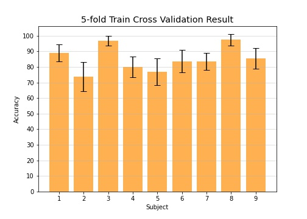

# Common Spatial Pattern

## Introduction
One significant step in brain-computer interface (BCI) signal processing is feature extraction, in motor-imagery (MI) paradigm a commonly used method is called common-spatial pattern (CSP). This is my implementation of CSP algorithm on BCI dataset IV 2a. The algorithm implemented in this code is based on [1], details of the dataset can be seen on [2]

## Result

## References
[1] B. Blankertz, R. Tomioka, S. Lemm, M. Kawanabe and K. Muller, "Optimizing Spatial filters for Robust EEG Single-Trial Analysis," in IEEE Signal Processing Magazine, vol. 25, no. 1, pp. 41-56, 2008, doi: 10.1109/MSP.2008.4408441.

[2] C. Brunner, R. Leeb, G. Mller-Putz, A. Schlögl and G. Pfurtscheller, “BCI Competition 2008 Graz Data Set a”, 2008.

### Footnote
* develop folder contains previous version of CSP code, might be deleted later
* the code is still in progress, need to work on how to evaluate on test dataset
* BCICIVC2a stands for BCI Competition IV dataset 2a
